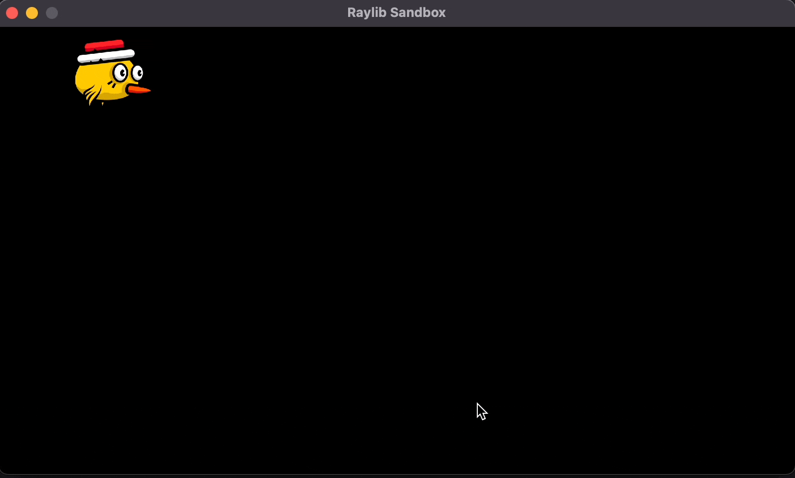

# It's simply a sandbox for raylib

Here I explore how to use raylib properly.

*include/standalone*: for things that are really easy, and for exprienment only, these will only be used in the test.

## Voronoi generation using JFA(Jump Flooding Algorithm)

Implementation: [voronoi.h](./include/standalone/voronoi.h)

Showcase: 

> Reference
> 1. https://github.com/maciejczyzewski/fast_gpu_voronoi
> 2. [Jump Flooding in GPU with Applications to Voronoi Diagram and Distance Transform](https://www.comp.nus.edu.sg/~tants/jfa/i3d06.pdf)

## ECS Implementation

The ECS design is really like database.

- Entity: primary key of the game object.
- Component: each attribute(like column of database) of an entity.
- System: how the system update and render the entity.

After making a new component, we just need to attach it to the specific entity, and make a new system to handle this component, then we are all set.

In conclusion, ECS design is all about separating the data from the logic(function) on the data.

You can use W/A/S/D to move the bird.

